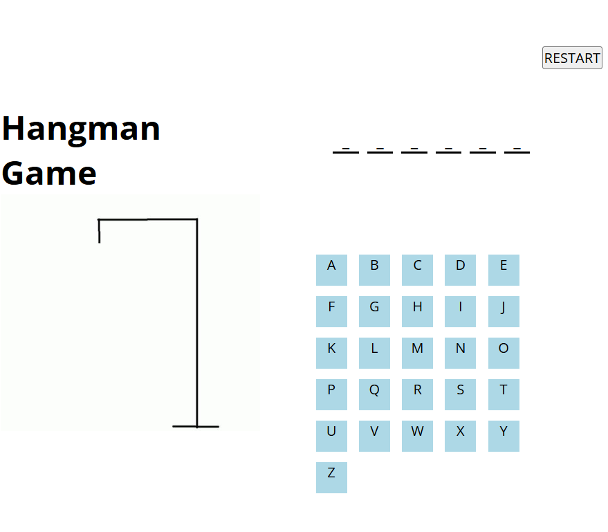

# Hangman Game

## About The Game
Hangman is a guessing game for two or more players. One player thinks of a word, phrase, or sentence and the other(s) tries to guess it by suggesting letters or numbers within a certain number of guesses. Originally a paper-and-pencil game, there are now electronic versions

## How To Play The Game
1. Choose one person to be guess the word

2. The guesser(s)” start guessing letters of the word.

3. The game draws a blank line for each letter in 
the word. 

4. The guesser(s)” start guessing letters

5. The game is over when: The guesser(s) complete the word **or** The game completes the the hang.

## Win Condition
First of all A random word will be choosen by the game so the only ne condition to win the game is by guessing the letters of the choosen word before the draw complete.

## Methods