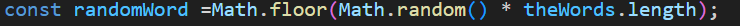
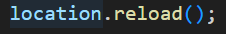

# Hangman Game

## About The Game
Hangman is a guessing game for two or more players. One player thinks of a word, phrase, or sentence and the other(s) tries to guess it by suggesting letters or numbers within a certain number of guesses. Originally a paper-and-pencil game, there are now electronic versions

## How To Play The Game
1. Choose one person to be guess the word

2. The guesser(s)” start guessing letters of the word.

3. The game draws a blank line for each letter in 
the word. 

4. The guesser(s)” start guessing letters

5. The game is over when: The guesser(s) complete the word **or** The game completes the the hang.

## Win Condition
First of all A random word will be choosen by the game so the only ne condition to win the game is by guessing the letters of the choosen word before the draw complete.

## Methods
* The String **.fromCharCode()** this method convert the number to a string

* This loop starts with 97 an ends with 122 which refers a to z

* The main job for this function is when user click a button the function let you pass the letter that user click

* That what makes the game choose a random word 

* location.reload() this what makes the restart button refresh the game

## References

* (https://www.youtube.com/watch?v=lk2KedMtgaI&list=PLDoPjvoNmBAwPhjRUnmlUlc377dmYtpWg&index=5)

* (https://www.wikihow.com/Play-Hangman#:~:text=Things%20You%20Should%20Know%201%20The%20object%20of,a%20hangman%20to%20avoid%20scaring%20or%20offending%20anyone.)

* (https://www.w3schools.com/jsref/jsref_fromcharcode.asp)

